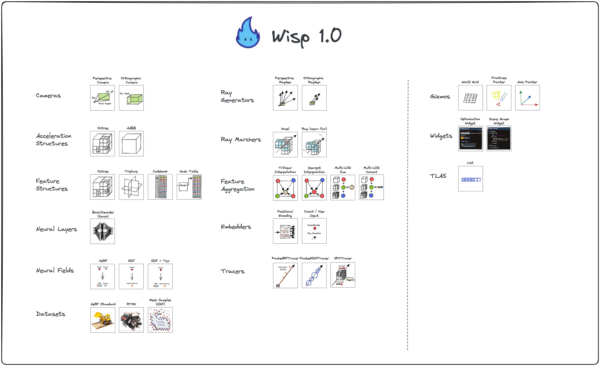

# Kaolin Wisp: A PyTorch Library and Engine for Neural Fields Research


NVIDIA Kaolin Wisp is a PyTorch library powered by [NVIDIA Kaolin Core](https://github.com/NVIDIAGameWorks/kaolin) to work with
neural fields (including NeRFs, [NGLOD](https://nv-tlabs.github.io/nglod), [instant-ngp](https://nvlabs.github.io/instant-ngp/) and [VQAD](https://nv-tlabs.github.io/vqad)).

NVIDIA Kaolin Wisp aims to provide a set of common utility functions for performing research on neural fields. 
This includes datasets, image I/O, mesh processing, and ray utility functions. 
Wisp also comes with building blocks like differentiable renderers and differentiable data structures 
(like octrees, hash grids, triplanar features) which are useful to build complex neural fields. 
It also includes debugging visualization tools, interactive rendering and training, logging, and trainer classes.

For an overview on neural fields, we recommend you check out the EG STAR report: 
[Neural Fields for Visual Computing and Beyond](https://arxiv.org/abs/2111.11426).

## Latest Updates

* _05/01/23_ Mains are now introduced as standalone apps, for easier support of new pipelines (**breaking change**) 
* _21/12/22_ Most modules have been cleaned, reorganized and documented. 

## Installation

See installation instructions [here](INSTALL.md).

## Building Blocks



* Differentiable feature grids
    * Octree grids (from NGLOD)
    * Hash grids (from Instant-NGP)
    * Triplanar texture grids (from ConvOccNet, EG3D)
    * Codebook grids (from VQAD)
* Acceleration structures for fast raytracing
    * Octree acceleration structures based on Kaolin Core SPC
* Tracers to trace rays against neural fields
    * PackedSDFTracer for SDFs
    * PackedRFTracer for radiance fields (NeRFs)
* Various datasets for common neural fields
    * Standard Instant-NGP compatible datasets
    * RTMV dataset
    * SDF sampled from meshes
* An interactive renderer where you can train and visualize neural fields
* A set of core framework features (`wisp.core`) for convenience
* A set of utility functions (`wisp.ops`)

Have a feature request? Leave a GitHub issue!

### Quick Links
The following links contain additional information about various aspects of the library:
* [wisp](wisp) The core library, containing various building blocks useful for optimizing & building neural field based pipelines.
  * [wisp/model](wisp/models) is a subpackage containing modules to construct neural fields.
  * [wisp/trainers](wisp/trainers) is a subpackage containing default trainers which are useful to extend.
  * [wisp/renderer](wisp/renderer) is a subpackage containing logic related to the interactive renderer.

## Applications: Training & Rendering with Wisp

The Wisp repository includes:
* [app](app) - Complete implementations of papers & projects using Wisp components.
  * [app/nerf](app/nerf) is the Wisp's upgraded NeRF app, with support for various grids types.
  * [app/nglod](app/nglod) is an implementation of the paper _Neural Geometric Level of Detail ([Takikawa et al. 2021](https://nv-tlabs.github.io/nglod/)).
* [examples](examples) - Smaller demos demonstrating specific features & use cases of Wisp.
  * [examples/latent_nerf](examples/latent_nerf) - demonstrates how to add a new NeuralField module, which exposess the latent dimensions as output & visualizes it.
  * [examples/spc_browser](examples/spc_browser) - an app for converting meshes to [Structured Point Clouds](https://kaolin.readthedocs.io/en/latest/notes/spc_summary.html), and visualizing them.


### Configurations

Want to run the Wisp apps with different options? Our configuration system makes this very easy.

Wisp apps use a mixture of config files and CLI arguments, which take higher precedence.
For example, if you want to run NeRF with a different number of levels of details:
```
python3 app/nerf/main_nerf.py --config app/nerf/configs/nerf_octree.yaml --dataset-path /path/to/lego --num-lods 1
```

Arg values not specified through yaml or CLI will resort to the default value the main script specifies, when available.

Take a look at the respective `main_X.py` script of each app for the list of different options you can pass in, and `configs/Y.yaml` 
for some complete configurations.

Wisp also supports hierarchical configs, by using the `parent` argument in the config to set a parent 
config file path in relative path from the config location or with an absolute path. Note however that 
only a single level of hierarchy is allowed to keep the indirection manageable.

If you get any errors from loading in config files, you likely made a typo in your field names. Check
against the app main as your source of truth. (Or pass in `-h` for help).


### Viewing Results

Most apps, i.e. `main_nerf.py`, will generate logs inside `_results/logs/runs/test-X` in which you can find outputs like the trained 
checkpoint, and `EXR` images of validation outputs. We highly recommend that you install 
[tev](https://github.com/Tom94/tev) as the default application to open EXRs.

To view the logs with TensorBoard:
```
tensorboard --logdir _results/logs/runs
```

### Interactive training

To run the apps interactively using the renderer engine, run:
```
WISP_HEADLESS=0 python3 app/main_nerf.py -config app/nerf/configs/nerf_hash.yaml --dataset-path /path/to/lego --dataset-num-workers 4
```

To disable interactive mode, and run wisp _without_ loading the graphics API, set the env variable:
```
WISP_HEADLESS=1
```
Toggling this flag is useful for debugging on machines without a display. 
This is also needed if you opt to avoid installing the interactive renderer requirements.

### Experiment Tracking with [Weights & Biases](https://wandb.ai/site)

To track training and validation metrics, render 3D interactive plots, reproduce your configurations and results, and many more features in your Weights & Biases workspace just add the additional flag `--wandb_project <your-project-name>` when initializing the training script.

Complete list of features supported by Weights & Biases:

- Log training and validation metrics in real time.
- Log system metrics in real time.
- Log RGB, RGBA, Depth renderings etc. during training.
- Log interactive 360 degree renderings post training in all levels of detail.
- Log model checkpoints as [Weights & Biases artifacts](https://wandb.ai/site/artifacts).
- Sync experiment configs for reproducibility.
- Host Tensorboard instance inside Weights & Biases run.

The full list of optional arguments related to logging on Weights & Biases include:

- `--wandb-project`: Name of Weights & Biases project
- `--wandb-run-name`: Name of Weights & Biases run \[Optional\]
- `--wandb-entity`: Name of Weights & Biases entity under which your project resides \[Optional\]
- `--wandb-viz-nerf-angles`: Number of angles in the 360 degree renderings \[Optional, default set to 20\]
- `--wandb-viz-nerf-distance`: Camera distance to visualize Scene from for 360 degree renderings on Weights & Biases \[Optional, default set to 3\]


## What is "wisp"?


Our library is named after the atmospheric ghost light, will-o'-the-wisp, 
which are volumetric ghosts that are harder to model with common standard 
geometry representations like meshes. We provide a [multiview dataset](https://drive.google.com/file/d/1jKIkqm4XhdeEQwXTqbKlZw-9dO7kJfsZ/view) of the 
wisp as a reference dataset for a volumetric object. 
We also provide the [blender file and rendering scripts](https://drive.google.com/drive/folders/1Via1TOsnG-3mUkkGteEoRJdEYJEx3wgf?usp=sharing) if you want to generate specific data with this scene, please refer to the [readme.md](https://drive.google.com/file/d/1IrWKjxxrJOlD3C5lDYvejaSXiPtm_XI_/view?usp=sharing) for greater details on how to generate the data. 


## External Contributions

We welcome & encourage external contributions to the codebase!
Special thanks for community members:
* [lightfield botanist](https://github.com/3a1b2c3)
* [Soumik Rakshit](https://github.com/soumik12345)


## Thanks

We thank James Lucas, Jonathan Tremblay, Valts Blukis, Anita Hu, and Nishkrit Desai for giving us early feedback
and testing out the code at various stages throughout development. 
We thank Rogelio Olguin and Jonathan Tremblay for the Wisp reference data. 


## License and Citation

This codebase is licensed under the NVIDIA Source Code License. 
Commercial licenses are also available, free of charge. 
Please apply using this link (use "Other" and specify Kaolin Wisp): https://www.nvidia.com/en-us/research/inquiries/

If you find the NVIDIA Kaolin Wisp library useful for your research, please cite:
```
@misc{KaolinWispLibrary,
      author = {Towaki Takikawa and Or Perel and Clement Fuji Tsang and Charles Loop and Joey Litalien and Jonathan Tremblay and Sanja Fidler and Maria Shugrina},
      title = {Kaolin Wisp: A PyTorch Library and Engine for Neural Fields Research},
      year = {2022},
      howpublished={\url{https://github.com/NVIDIAGameWorks/kaolin-wisp}}
}
```
