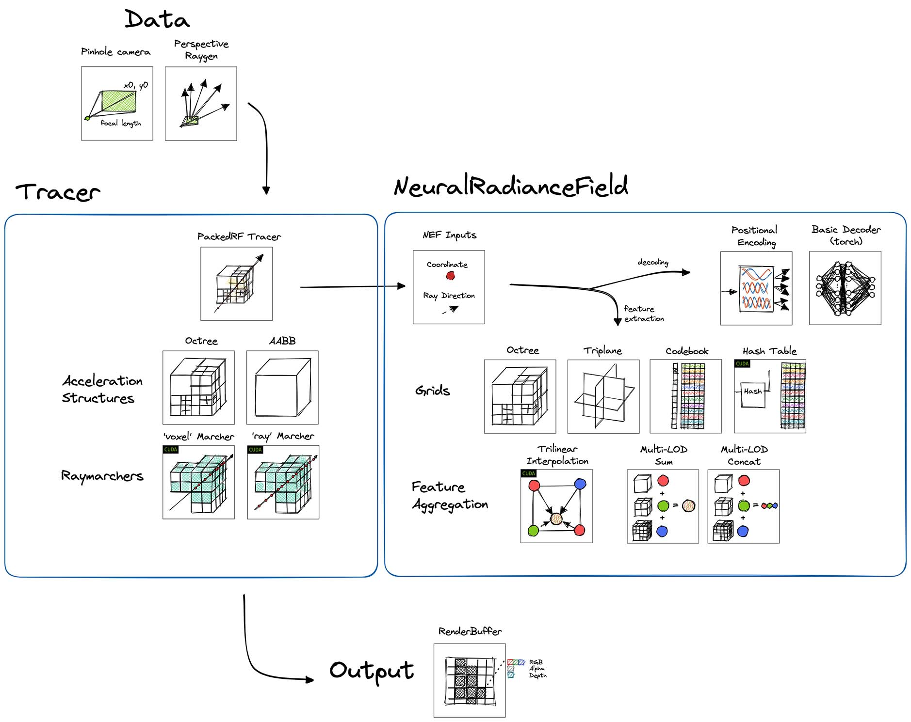

# NeRF: Neural Radiance Fields for View Synthesis

## Overview

Wisp takes a pragmatic approach to its implementation of NeRF, and refers to a family of works around neural radiance fields.
Rather than following the specifics of [Mildenhall et al. 2020](https://www.matthewtancik.com/nerf), Wisp's implementation is closer to works like _Variable Bitrate Neural Fields_ ([Takikawa et al. 2022](https://nv-tlabs.github.io/vqad/))
and _Neural Sparse Voxel Fields_ ([Liu et al. 2020](https://lingjie0206.github.io/papers/NSVF/)) which rely on grid feature structures.

### Differences to original NeRF paper

The original paper of [Mildenhall et al. 2020](https://www.matthewtancik.com/nerf) did not assume any grid structures,
which since then have been gaining popularity in the literature. Where possible, Wisp prioritizes interactivity, and accordingly, our implementation assumes a (configurable) grid structure,
which is critical for interactive FPS.

Another difference to the original NeRF is the coarse -> fine sampling scheme which is not implemented here.
Instead, Wisp uses sparse acceleration structures which avoid sampling within empty cells (that applies for Octrees, Codebooks, and Hash grids).  

The neural field implemented in this app assumes a 3D coordinate input + view direction, and outputs density + RGB color.

### Octree / Codebook

The Octree & Codebook variants follows the implementation details of NGLOD-NeRF from [Takikawa et al. 2022](https://nv-tlabs.github.io/vqad/),
which uses an octree both for accelerating raymarching and as a feature structure queried with trilinear interpolation.

Specifically, our implementation follows the implementation section, which discusses a modified lookup function that avoids artifacts: 
"any location where sparse voxels are allocated for the _coarsest_ level in the multi-resolution hierarchy can be sampled". 

Simply put, the octree grid takes `base_lod` and `num_lods` arguments, where the occupancy structure is defined as levels `1 .. base_lod`,
and the features are defined for levels `base_lods + 1 .. base_lods + num_lods - 1`. The coarsest level used for raymarching here is `base_lod`.

See also [this detailed report on Variable Bitrate Neural Fields](https://wandb.ai/geekyrakshit/kaolin-wisp-integration/reports/Variable-Bitrate-Neural-Fields--VmlldzozMDE0MDY0) and its usage with kaolin-wisp.
The report was published in the [Weights & Biases](https://wandb.ai/site) blog [Fully-Connected](https://wandb.ai/fully-connected).

[](https://wandb.ai/geekyrakshit/kaolin-wisp-integration)


### Triplanar Grid

The triplanar grid uses a simple AABB acceleration structure for raymarching, and a pyramid of triplanes in multiple resolutions.

This is an extension of the triplane described in [Chan et al. 2021](https://nvlabs.github.io/eg3d/), with support for multi-level features.

### Hash Grid

The hash grid feature structure follows the multi-resolution hash grid implementation of [Muller et al. 2022](https://nvlabs.github.io/instant-ngp/), backed by a fast CUDA kernel.

The default ray marching acceleration structure uses an octree, which implements the pruning scheme from the Instant-NGP paper to stay in sync with the feature grid.   


## Diagrams

The NeRF app is made of the following building blocks:



An interactive exploration of the optimization process is available with the `OptimizationApp`. 

## How to Run

### RGB Data

Synthetic objects are hosted on the [original NeRF author's Google Drive](https://drive.google.com/drive/folders/1JDdLGDruGNXWnM1eqY1FNL9PlStjaKWi).

Training your own captured scenes is supported by preprocessing with  [Instant NGP's colmap2nerf](https://github.com/NVlabs/instant-ngp/blob/master/docs/nerf_dataset_tips.md#preparing-new-nerf-datasets) script. 

**NeRF (Octree)**
```
cd kaolin-wisp
python3 app/nerf/main_nerf.py --config app/nerf/configs/nerf_octree.yaml --dataset-path /path/to/lego
```

**NeRF (Triplanar)**
```
cd kaolin-wisp
python3 app/nerf/main_nerf.py --config app/nerf/configs/nerf_triplanar.yaml --dataset-path /path/to/lego
```

**NeRF (Hash)**
```
cd kaolin-wisp
python3 app/nerf/main_nerf.py --config app/nerf/configs/nerf_hash.yaml --dataset-path /path/to/lego
```

Forward-facing scene, like the `fox` scene from [Instant-NGP](https://nvlabs.github.io/instant-ngp/) repository,
are also supported. 

Our code supports any "standard" NGP-format datasets that has been converted with the scripts from the 
`instant-ngp` library. We pass in the `--multiview-dataset-format` argument to specify the dataset type, which
in this case is different from the RTMV dataset type used for the other examples. 

The `--mip` argument controls the amount of downscaling that happens on the images when they get loaded. This is useful
for datasets with very high resolution images to prevent overload on system memory, but is usually not necessary for 
reasonably sized images like the fox dataset.


### RGBD Data

For datasets which contain depth data, Wisp optimizes by pre-pruning the sparse acceleration structure.
That allows faster convergence.

RTMV data is available at the [dataset project page](http://www.cs.umd.edu/~mmeshry/projects/rtmv/).

The additional arguments below ensure a raymarcher which considers the pre-pruned sparse structure is used.

**NeRF (Octree)**
```
cd kaolin-wisp
python3 app/nerf/main_nerf.py --config app/nerf/configs/nerf_octree.yaml --multiview-dataset-format rtmv --mip 2  --bg-color white --raymarch-type voxel --num-steps 16 --num-rays-sampled-per-img 4096 --dataset-num-workers 4 --dataset-path /path/to/V8
```

**NeRF (Codebook)**
```
cd kaolin-wisp
python3 app/nerf/main_nerf.py --config app/nerf/configs/nerf_codebook.yaml --multiview-dataset-format rtmv --mip 2 --bg-color white --raymarch-type voxel --num-steps 16 --num-rays-sampled-per-img 4096 --dataset-num-workers 4 --dataset-path /path/to/V8
```

### Memory considerations

* For faster multiprocess dataset loading, if your machine allows it try setting
`--dataset-num-workers 16`. To disable the multiprocessing, you can pass in `--dataset-num-workers -1`.
* The ``--num-steps`` arg allows for a tradeoff between speed and quality. Note that depending on `--raymarch-type`, the meaning of this argument may slightly change:
  * 'voxel' - intersects the rays with the cells. Then among the intersected cells, each cell
  is sampled `num_steps` times.
  * 'ray' - samples `num_steps` along each ray, and then filters out samples which fall outside of occupied
  cells.
* Other args such as `base_lod`, `num_lods` and the number of epochs may affect the output quality.

## Evaluation Metrics

* Metrics were evaluated on machine equipped with NVIDIA A6000 GPU.
* Total runtime refers to train time only, e.g.  _excludes the validation run_.
* Evaluation is conducted on 'validation' split only (lego, V8).

<div style="text-align: center;">
  <table>
      <tr>
          <th colspan="2"> Config </th>
          <th rowspan="2"> Data </th>
          <th colspan="3"> PSNR </th>
          <th colspan="2"> Total Runtime (min:secs) </th>
      </tr>
      <tr>
          <th> YAML </th>
          <th> CLI </th>
          <th> Epoch 100 </th>
          <th> Epoch 200 </th>
          <th> Epoch 300 </th>
          <th> To Epoch 100 </th>
      </tr>
      <tr>
          <td rowspan="2"> nerf_octree </td>
          <td> --mip 0 --num-steps 512 --raymarch-type ray --hidden-dim 64 </td>
          <td> lego </td>
          <td> 28.72 </td>
          <td> 29.39 </td>
          <td> 29.7 </td>
          <td> 05:48 </td>
      </tr>
      <tr>
          <td> --mip 2 --num-steps 16 --raymarch-type voxel --hidden-dim 128 </td>
          <td> V8 </td>
          <td> 28.46 </td>
          <td> 29.11 </td>
          <td> 29.56 </td>
          <td> 02:11 </td>
      </tr>
      <tr>
          <td> nerf_triplanar </td>
          <td> --mip 2 --num-steps 512 --raymarch-type voxel --hidden-dim 128 </td>
          <td> lego </td>
          <td> 31.13 </td>
          <td> 31.8 </td>
          <td> 32.3 </td>
          <td> 12:42 </td>
      </tr>
      <tr>
          <td> nerf_codebook </td>
          <td> --mip 2 --num-steps 16 --raymarch-type voxel --hidden-dim 128 </td>
          <td> V8 </td>
          <td> 27.71 </td>
          <td> 28.27 </td>
          <td> 28.49 </td>
          <td> 10:22 </td>
      </tr>
      <tr>
          <td rowspan="3"> nerf_hash </td>
          <td> --mip 0 --num-steps 2048 --raymarch-type ray --optimizer-type rmsprop --hidden-dim 128 </td>
          <td> lego </td>
          <td> 31.05 </td>
          <td> 31.96 </td>
          <td> 32.36 </td>
          <td> 01:38 </td>
      </tr>
      <tr>
          <td> --mip 0 --num-steps 512 --raymarch-type ray --optimizer-type adam --hidden-dim 64 </td>
          <td> lego </td>
          <td> 28.58 </td>
          <td> 29.20 </td>
          <td> 29.64 </td>
          <td> 01:16 </td>
      </tr>
      <tr>
          <td> -mip 2 --num-steps 16 --raymarch-type voxel --optimizer-type adam --hidden-dim 64
   </td>
          <td> V8 </td>
          <td> 28.48 </td>
          <td> 29.25 </td>
          <td> 29.51 </td>
          <td> 06:17 </td>
      </tr>
  </table>
</div>
