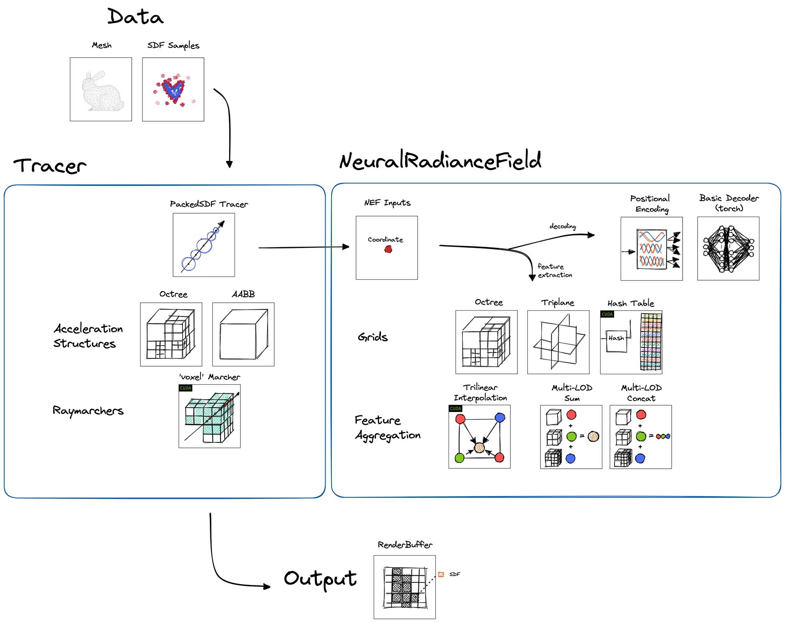

# Neural Geometric Level of Detail: Real-time Rendering with Implicit 3D Shapes

## Overview

This app implements _Neural Geometric Level of Detail_ ([Takikawa et al. 2021](https://nv-tlabs.github.io/nglod/)), a pipeline for optimizing Neural Signed Distance Functions.

A large portion of the codebase overlaps with the original work.
However, some differences from the original paper stand out:
- This version uses a shared decoder for multiple LODs, whereas the original work used a decoder per LOD.
- This version supports additional backbones in addition to the Octree, which didn't appear in the original publication.

## Diagrams

The NGLOD app is made of the following building blocks:



As described in the original NGLOD paper, training is performed directly over the SDF samples and sphere tracing is used only at inference time.

An interactive exploration of the optimization process is available with the `OptimizationApp`.

When using the non-interactive renderer (e.g. `OfflineRenderer`, used within the trainer for evaluation), outputs can be rendered with a matcap. 
Otherwise, surface normals will be visualized by default.


## How to Run

Neural SDFs are trained from mesh samples, a prerequisite is to download some mesh.
A sample OBJ file of the Spot cow is [available here](https://github.com/alecjacobson/common-3d-test-models/blob/master/data/spot.obj). 

To run the SDF training:

**NGLOD (Octree)**:
```
cd kaolin-wisp
python3 app/nglod/main_nglod.py --config app/nglod/configs/nglod_octree.yaml --dataset-path /path/to/spot.obj
```

Currently, the SDF sampler we have shipped with our code can be quite slow for larger meshes. We plan to
release a more optimized version of the SDF sampler soon.

To run with additional backbones: 

**NGLOD (Triplanar)**:
```
cd kaolin-wisp
python3 app/nglod/main_nglod.py --config app/nglod/configs/nglod_triplanar.yaml --dataset-path /path/to/spot.obj
```

**NGLOD (Hash)**:
```
cd kaolin-wisp
python3 app/nglod/main_nglod.py --config app/nglod/configs/nglod_hash.yaml --dataset-path /path/to/spot.obj
```

### Memory Considerations

* `--num-samples-on-mesh` determines how many SDF train samples are generated on the mesh surface. 
Lower end machines reduce the default number to avoid running out of memory.

