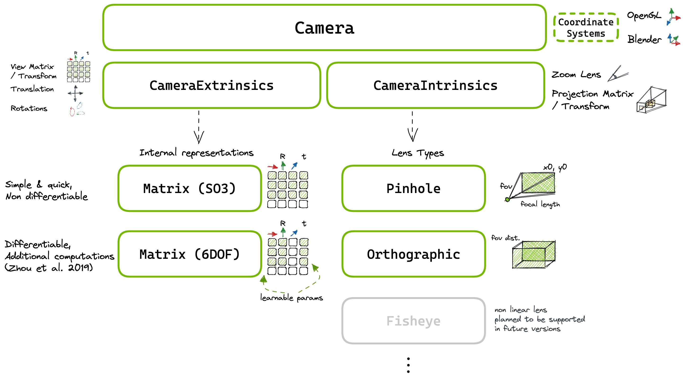
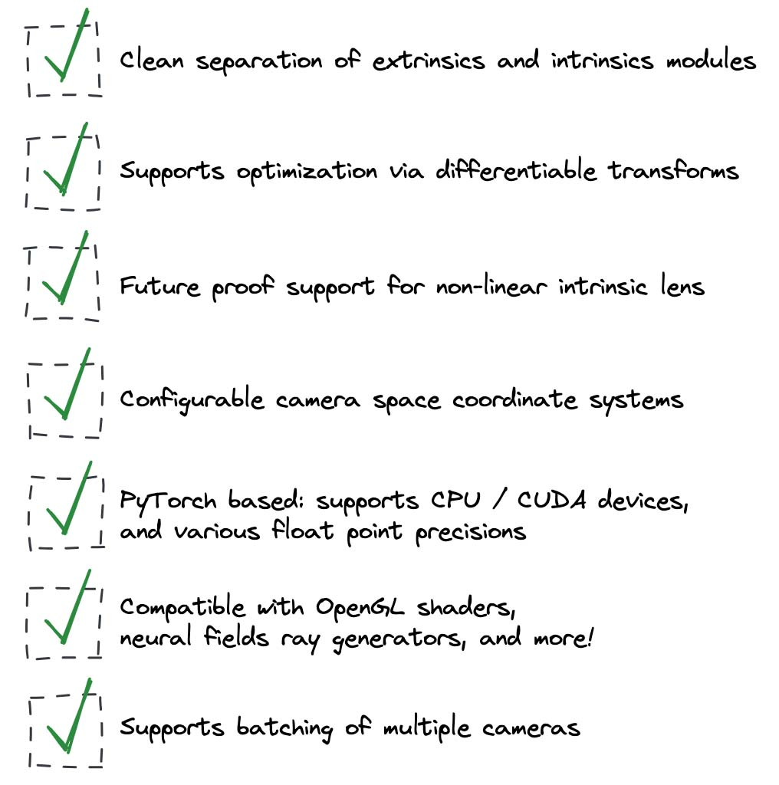

# Cameras & Ray Generation

## Cameras

:::{hint}
Wisp's cameras are managed within the kaolin library.
:::

The camera modules support various features beyond the optimization of neural fields, such as differentiable rendering, customized intrinsics, interactive movement, and more.

We highly recommend reviewing sections of the kaolin documentation to learn how to make the most of this module:

* [Quick Examples](https://github.com/NVIDIAGameWorks/kaolin/tree/master/examples/recipes/camera) for short code snippets demonstrating various usage examples.
* [Camera & Rasterization Tutorial](https://github.com/NVIDIAGameWorks/kaolin/blob/master/examples/tutorial/camera_and_rasterization.ipynb) for a full tutorial demonstrating the usage of the Camera module within a differentiable renderer.
* [Camera Documentation](https://kaolin.readthedocs.io/en/latest/notes/differentiable_camera.html) for the full documentation behind the camera module.

:::{note}
Ray generation is external to the cameras module and managed within wisp.
:::

See the [raygen module](https://github.com/NVIDIAGameWorks/kaolin-wisp/blob/main/wisp/ops/raygen/raygen.py) for this kind of functionality.

Note that ray generation functions such as `generate_pinhole_rays()`, convert from pixel space to world space, and therefore act as the pseudo-inverse of the 
`Camera.transform()` function, which converts from world space to NDC.
