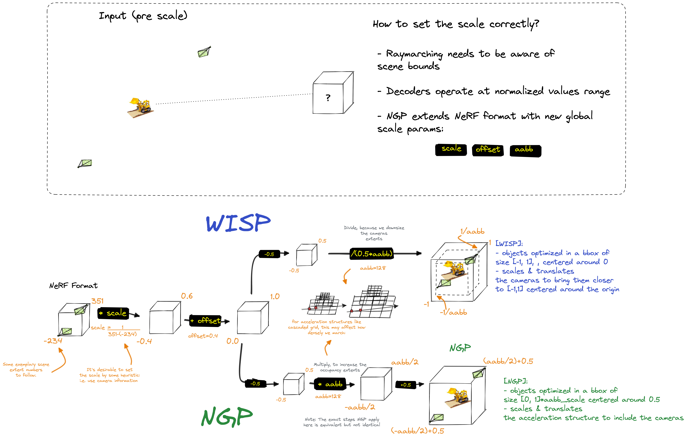
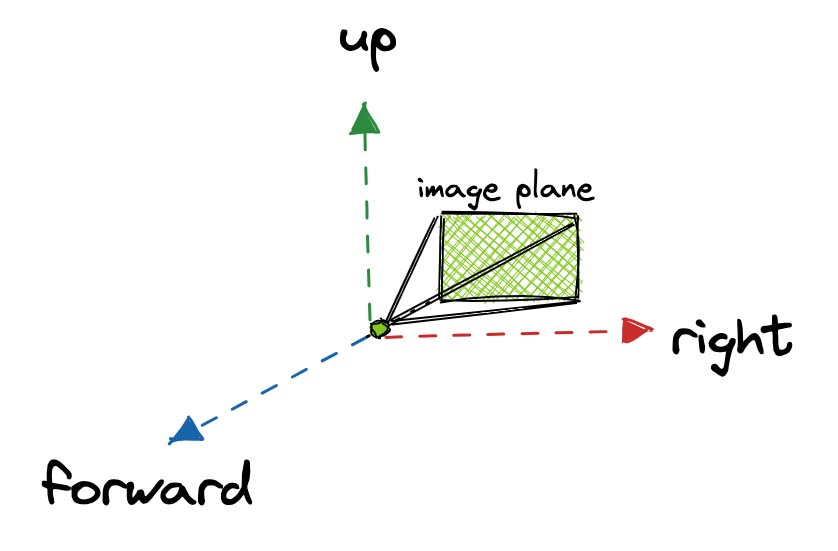
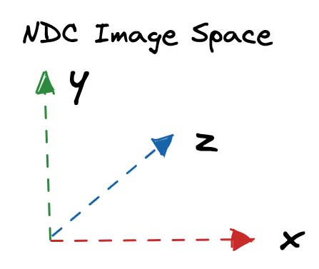

# Conventions

## Handling NeRF dataset format

:::{hint}
Wisp's acceleration structure follow the conventions of {doc}`Structured Point Clouds <example_spcbrowser>` (see `OctreeAS`),
which require coordinates in the range of `[-1, 1]`.
:::

Wisp normalizes data to fit within the range of `[-1, 1]`, which is opposite to the approach that [Instant-NGP](https://github.com/NVlabs/instant-ngp) takes.  
The diagram below illustrates the different flows:

## Coordinate Spaces

### Camera Coordinates

By default, the camera coordinates in wisp are aligned with OpenGL (right handed coordinate system).
This convention can be done by calling [`Camera.change_coordinate_system()`](https://kaolin.readthedocs.io/en/latest/modules/kaolin.render.camera.camera_extrinsics.html?highlight=change_coordinate#kaolin.render.camera.CameraExtrinsics.change_coordinate_system).

### NDC Space

The default NDC space in wisp uses a y-axis up, z points inwards (that is: a left handed SCREEN coordinate system). 

