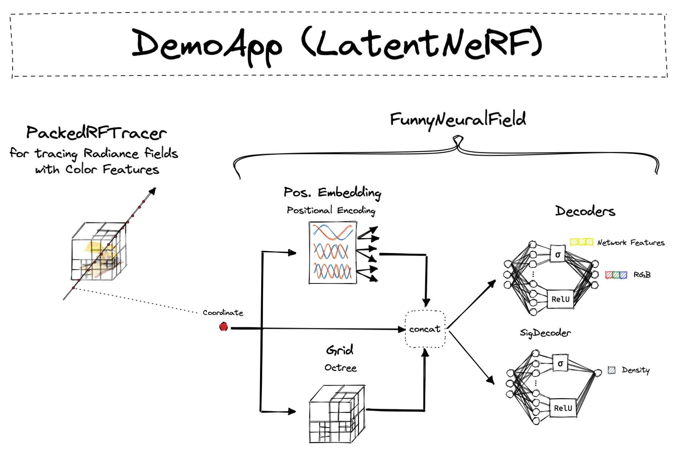

# NeRF with Traced Latents (SIGGRAPH 2022 Demo)

This example shows how to add a new type of **Neural Field** to wisp.
Specifically, the newly added Neural Field exposes some of its latent channels to the tracer.
To conclude the demo, an interactive demo app which renders the latent color channels is created.

A full video walkthrough is [available here](https://www.nvidia.com/en-us/on-demand/session/siggraph2022-sigg22-s-14/?playlistId=playList-92d9241d-6d4c-4fc7-88f6-eb8484008787).


## Overview



## Running the Demo

The simplest configuration uses an Octree grid: 
```
cd /examples/latent_nerf
python3 main_demo.py --config demo_octree.yaml --dataset-path /path/to/nerf_lego
```

You can also experiment with a faster, alternative configuration which uses the Hashtable:
```
cd /examples/latent_nerf
python3 main_demo.py --config demo_hash.yaml --dataset-path /path/to/nerf_lego
```

For brevity, this example omits the pruning operation, which leaves white artifacts around the object.
Adding the pruning operation from `NeuralRadianceField` is straightforward and left as an exercise for the reader :)

Additional datasets can be easily supported by changing the config.
i.e. try modifying the config to: 
`dataset: autoconfig(RTMVDataset)`. See `app/nerf/` for more details.

## Files

`funny_neural_field.py` contains:
* The implementation of the custom `SigDecoder`, with a specialized forward function that exposes 3 latent channels.
* The initialization of the feature grid, positional encoding, and decoders.
* 2 forward functions for the tracer to invoke: `rgba()` and `color_feature()`. The example shows how to register these.

`demo_app.py` is the interactive app which visualizes the optimization process.
It includes additional logic for defining the new `color_feature` channel.

`demo_octree.yaml` and `demo_hash.yaml` are the configuration files used to run this example.

`main_demo,py` is the main script for registering the new neural field class and running the interactive demo.
