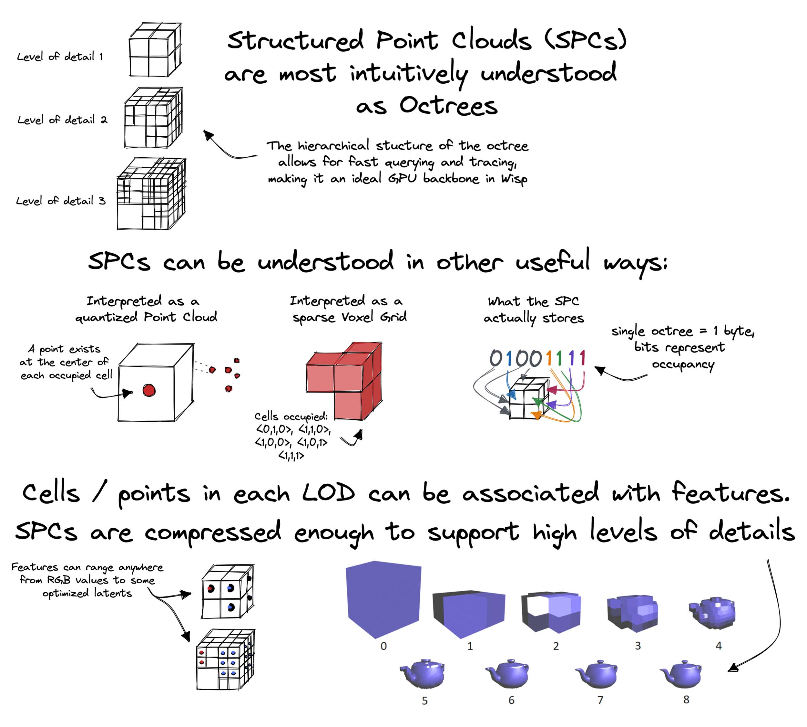
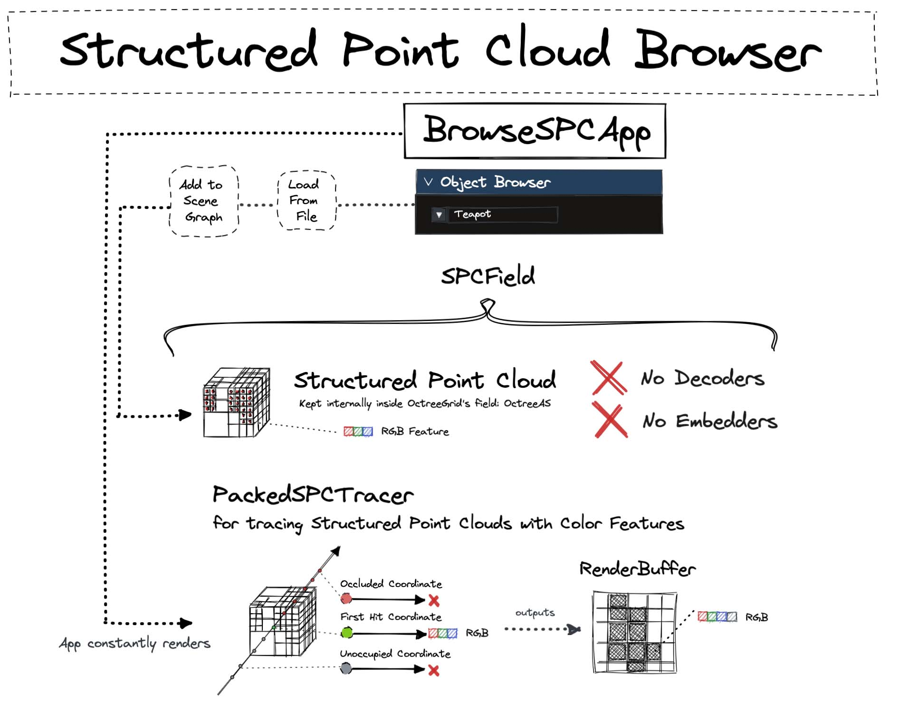

# Structured Point Cloud (SPC) Browser

This example shows how to use wisp to build an interactive visualizer app which loads and renders **Structured Point Cloud (SPC)** objects. 

In this tutorial you will learn:
* How to convert meshes with a _single material_ to Structured Point Clouds.
* Create a custom widget that browses and displays Structured Point Clouds stored on the disk.

## What are Structured Point Clouds?

**SPCs** are efficient data structures for storing and optimizing 3D data.
Various primitives, such as point clouds, voxels and meshes can be converted to SPC format for quick visualization within wisp.



**SPCs** are compressed GPU data structures, and are heavily used around wisp to implement useful components
such as acceleration structures and feature grids.
For the purpose of this example however, we will simply visualize them as "sparse voxel grids",
That is, we will keep RGB features per cell, and trace them. 
In this example no optimization will take place.

## Overview



We begin the example by running a preprocessing script which loads some `*.obj` file and converts it to a SPC,
which is stored on the disk in `*.npz` format.

The core of this example demonstrates how SPCs can be added and removed from the scene graph using a
new custom created widget. See `paint()` logic of `widget_spc_selector.py` for examples of how SPCs are
loaded, and then added or removed from the scene graph.

The `Pipeline` of SPC objects, used for visualization, is handled by `wisp.tracers.PackedSPCTracer` and `wisp.models.nefs.spc_field.SPCField`.  

## Running the Demo

### Preprocessing
The example requires to first convert some `*.obj*` files to `*.npz` format.
An example input is `colored_sphere.obj` from [kaolin's samples](https://github.com/NVIDIAGameWorks/kaolin/tree/master/examples/samples).

```
cd /examples/spc_browser
python3 mesh2spc.py --obj_path <PATH_TO_SPC> [--output_path <OUTPUT_PATH> --level <NUM_LODS] --num_samples <NUM_SAMPLES>]
```

Arguments in squared brackets are optional. See `python3 mesh2spc.py --help` for further details about the optional args.
The SPC output format assumes each file has an "octree" entry and a "color" feature.

Note: conversion to SPC may be lossy, where the `levels` and `num_samples` control the memory-quality tradeoff.
Therefore, in practice SPCs should be assumed to be merely _approximated_ visualization of meshes.

### Running the SPCBrowser App

The app assumes a SPC folder with multiple `*.npz` files.

```
cd /examples/spc_browser
python3 main_spc_browser.py --dataset-dir <PATH_TO_SPC_FOLDER>
```

Proceed by browsing objects in the *Object Browser* tab within the gui.

## Files

`browse_spc_app.py` is the interactive app which visualizes the loaded SPCs process.
It also governs the global app definitions: keeps the dataset dir in a custom field of `WispState.extent`,
and creates the custom spc selector widget.

`widget_spc_selector.py` is a custom widget created specifically for this example. The `paint()` logic
presents the available files, and handles adding and removing new spc pipelines from the scene graph.

`main_spc_browser.py` is the main script for running the interactive demo.

`mesh2spc.py` is preprocess script.

### Why are some of the SPC files included in the library itself?

`spc_field` and `packed_spc_tracer` were promoted to the core library due to their
usefulness beyond the scope of this example.
They may be used to trace, for example, approximated sparse voxel grids and quantized point clouds.

### Further Reading
SPCs are powerful tools, and support sparse convolutions and interpolations, among other operations.
Check out the [Kaolin documentation page](https://kaolin.readthedocs.io/en/latest/notes/spc_summary.html) for 
additional details.