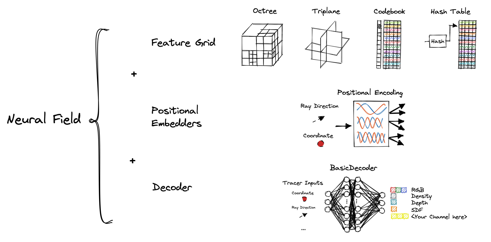
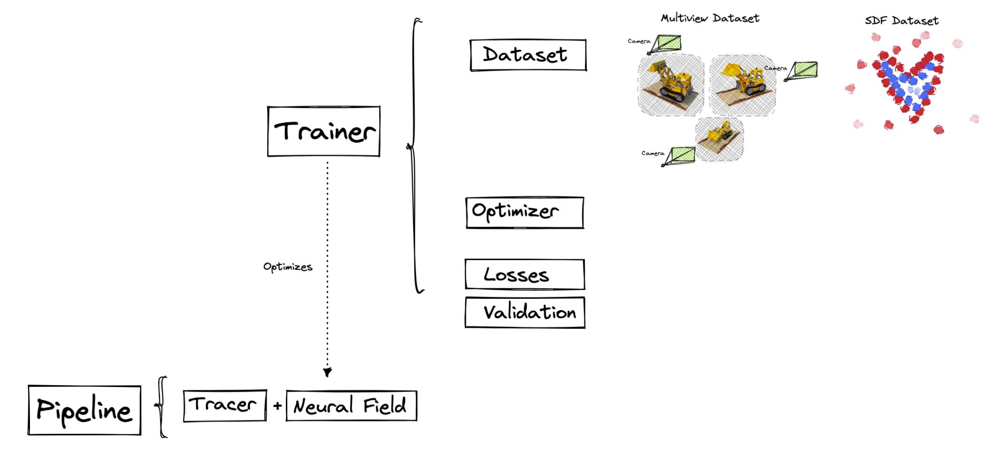
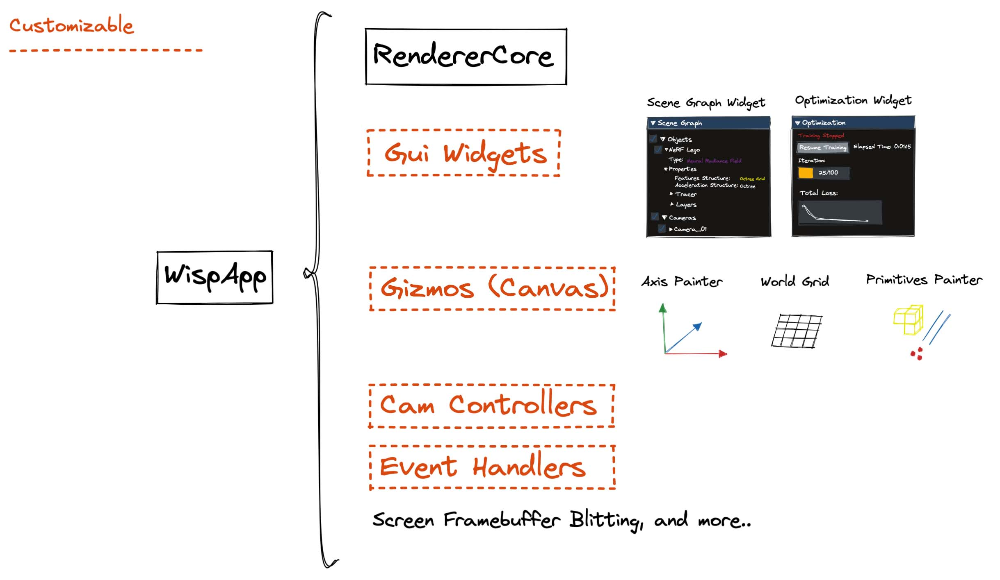
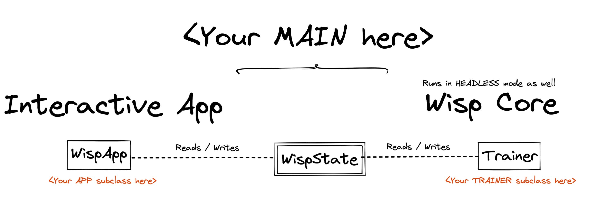

# Templates

This folder contains a starter kit for new wisp projects.
New projects can be quickly created by cloning this folder, and further customizing its files.
The templates follow the popular example of **Neural Radiance Fields**.
Other field types (i.e. **Neural Signed Distance Functions**) can also be derived from these templates.

## Template Files

`template_neural_field` is a one-stop for defining new neural fields. 
In wisp, a **neural field** (**nef**) is as a combination of a feature grid structure, a decoder, and an optional input embedding.
New channels can be supported by implementing and registering additional forward functions here.
The input to forward functions is provided by `BaseTracer` implementation.
For example, a `PackedRFTracer`, which traces radiance fields, passes the input coordinates and ray direction.
Consequentially, Neural field implementations should be mindful of which tracers they're compatible with.

`template_trainer` orchestrates the optimization process, from data load to loss calculation and metrics logging.
`BaseTrainer` functions can be overrided to take control of lifecycle events such as `pre_epoch()`, a single training `step()`, and
invocation of `validation()`. The trainer typically holds a `Pipeline` object, which pairs the neural field currently being optimized,
and a compatible `BaseTracer`. `Pipeline` contains all components required to differentiably render a neural field.

`template_app` is an exemplary implementation of an interactive app.
The app controls which gui widgets are created and how visual properties of the canvas are customized. 
It can also register event handlers due to changes within the shared `WispState` object.
The scene graph can also be manipulated here.

`template_config` contains configurations for customizing the templates defined above, as well as existing
Wisp components. The configurations are parsed by the `config_parser`, and passed directly to built 
components.

`template_main` is a simple main script for tying the entire **templates** example together.
It registers newly added user files to ensure `config_parser` knows how to load them.
It then creates the shared `WispState` object, and the template **trainer** and **app** objects which 
share this state. The app loop is finally run here to initiate the interactive app.

## Where to go from here

`wisp.ops` contains useful building blocks for further customizing the templates.

Advanced users may customize other building blocks such as Tracers, Datasets and BottomLevelRenderers,
currently not provided in the form of templates.

**Come up with useful components? We welcome you to submit a PR!**
