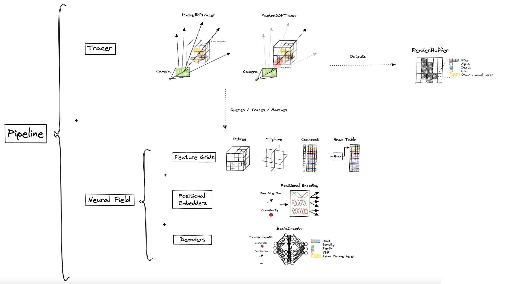

# Wisp Renderer

This folder contains the logic for Wisp's interactive visualizer.

## For Beginners

The app controls which gui widgets are created and how visual properties of the canvas are customized. 
It can also register event handlers due to changes within the shared `WispState` object.
The scene graph can also be manipulated here.

To create your own interactive app, simply subclass `WispApp` from `wisp/renderer/app/wisp_app.py` and customize its behaviour.
See `wisp/renderer/app/optimization_app.py` for a working example (it's recommended to clone and modify this file).
App modifications are possible by manipulating the `WispState` object, or overriding specific `WispApp` methods.

Wisp is already packed with an app for interactive visualization of optimizations. 
See `OptimizationApp` from `wisp/renderer/app/optimization_app.py`.

## Extending Apps

The interactive visualizer gui and canvas can be extended with new components:
* `widgets` control the behaviour of the gui. New widgets can be added by implementing `WidgetImgui` using the `imgui`.
* `gizmos` are painted over the canvas. New gizmos can be added by implementing `Gizmo` with `glumpy` and `OpenGL`.

Newly added `widgets` and `gizmos` can be directly added to the `WispApp`.

## The SceneGraph

`wisp/renderer/core/api/scenegraph.py` contains the interface for manipulating the scene graph. 
New objects can be added or removed from the scene, and the renderer can be requested to fully redraw the scene
to reflect recent modifications. 

Neural field objects are represented in the form of `Pipeline` objects (a combination of a **Neural Field** and a **Tracer**).

## Additional Public API

`wisp/renderer/core/api` contains the logic required for supporting new types of objects with the interactive visualizer.

`base_renderer.py` contains the basic entities used by the renderer.
All renderable objects must implement the `BottomLevelRenderer` interface, which knows how to produce:
* A `RenderBuffer` of the rendered object from the current view. 
* DataLayers, represented as vector `PrimitivesPack` objects.

Wisp further distinguishes between ray-traced objects and rasterized ones with the `RayTracedRenderer` and `RasterizedRenderer` subclasses.

### Advanced: implementing a BottomLevelRenderer / RayTracedRenderer

When wisp observes a new neural object's `Pipeline` in the scene graph, it will attempt to construct the matching `RayTracedRenderer`
(this process is governed by `wisp/renderer/core/api/renderers_factory`). 

To ensure the factory knows how to perform this matching: a `RayTracedRenderer` should be registered with the **tracers** and **neural fields** it supports:
1. `register_neural_field_type()` from the factory model can be used directly.
2. The `@field_renderer` decorator can also be used to conveniently register `BottomLevelRenderer` implementations with compatible `(BaseNeuralField, BaseTracer)` pairs.
 
When the factory finds about a new neural `Pipeline` object, it will try to create a corresponding `RayTracedRenderer` instance in the following scheme:
1. Look for a `RayTracedRenderer` matched with the `Pipeline` **tracer** and **neural field**.
2. If no matching `RayTracedRenderer` was found, recurse through the **neural field** hierarchy and look for a match with **tracer** and the parent **neural field** classes.
3. If no matching `RayTracedRenderer` was found, recurse through the **tracer** hierarchy and look for matches with the parent **tracer** and the **neural field** classes explored in step 2.

If no renderer was found, the interactive app will assert.

#### Should you implement a BottomLevelRenderer / RayTracedRenderer?
Wisp is shipped with `NeuralRadianceFieldPackedRenderer` and `NeuralSDFPackedRenderer`, both are registered with the `BaseNeuralField`, as well as `PackedRFTracer` and `PackedSDFTracer` respectively.

New type of **Neural Fields** supported by the default tracers (i.e. `PackedRFTracer` and `PackedSDFTracer`) will automatically be supported by these implementations.

A `BottomLevelRenderer`  should usually be implemented if:
1. You've implemented a new type of Tracer, which is incompatible with the default `BottomLevelRenderer` implementations.
2. You're interested in augmenting a bottom level renderer with additional data layers.
3. You're implementing a non-neural object which is not supported by the above.

Note that in some cases, it's enough to register your new **tracer** or **neural field** with the default renderers. 

#### Where do the RayTracedRenderer args come from?

When a `RayTracedRenderer` is constructed out of a `Pipeline`, wisp will query the tracer's arguments.
The `RayTracedRenderer` will then use a new instance of the tracer, constructed using the `Pipeline`'s tracer args, to ensure the interactive visualizer does not interfere with any ongoing neural optimization.

#### Why are they called BottomLevelRenderers?

To support future primitives, wisp's definition of "renderable" objects is fairly loose.
`BottomLevelRenderers` are expected to produce `RenderBuffer` which can be blended to form the final framebuffer displayed on the canvas.

For optimization reasons, `BottomLevelRenderers` can be thought of leaf nodes within the scene graph managed by some **Top Level Acceleration Structure (TLAS)**.

See the full diagram below.

## The Renderer Core 

The Renderer Core is responsible for all drawing logic unrelated to the `gui` or a specific graphics api (i.e. `gizmos` assume OpenGL implementations and are handled separately).

